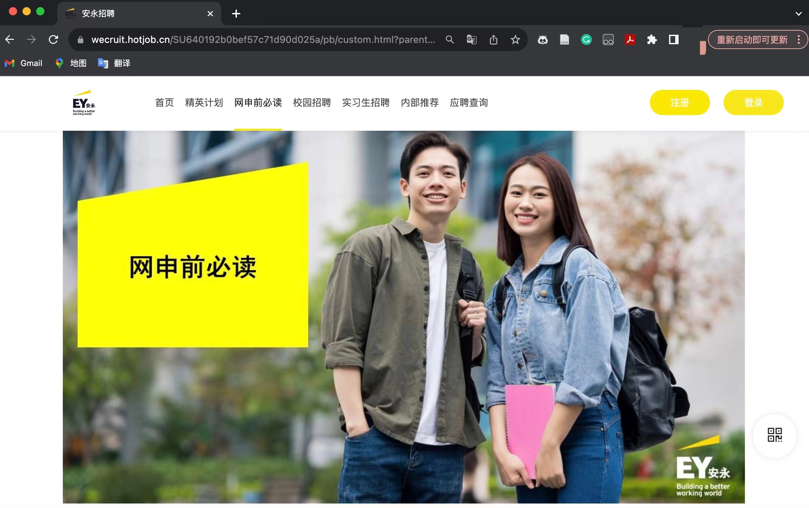
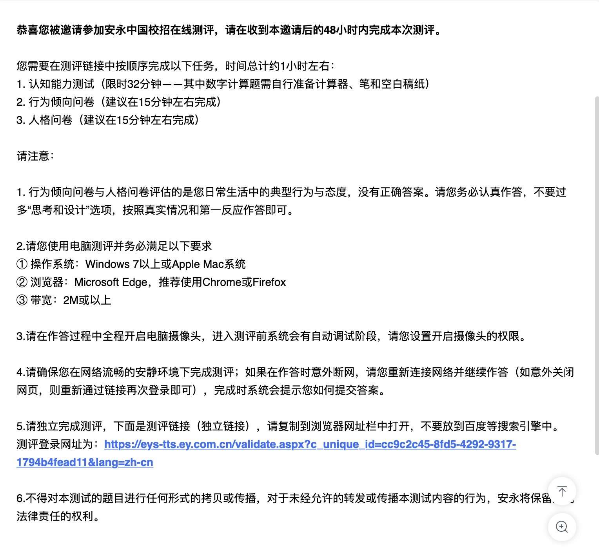
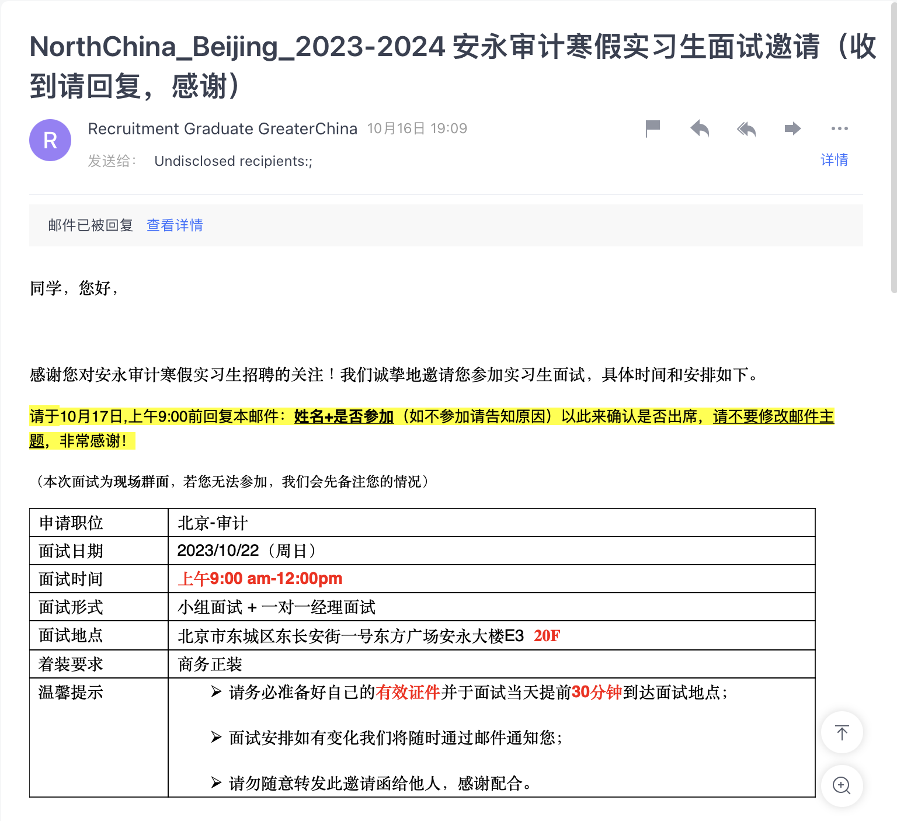

## ·简历
## ·网申
## ·在线测评
## ·面试
## ·Offer

##                              简历
1.安永要求中英文简历，大家在做简历的时候最好一起做出来；
2.安永校园宣讲的HR小姐姐建议不要在简历中过多地阐述主修课程，可以写一些计算机相关的课程（PS：审计似乎很看重计算机技能）；
4.简历上可以写一些和有兴趣的审计组相关的经历，比如面试我的面试官就是fso金融服务组做衍生品相关的manager，她问了我很多简历上关于衍生品的内容；
3.简历中一定不要出现错别字和错误的英文单词，不求有功但求无过。

##                              网申
安永网申地址可以直接百度。另外，安永校招小程序也能实现投递简历、查询投递状态等功能。网申之前大家最好认真看一下“网申前必读”，里面提到了很多需要大家网申前提前准备的材料（成绩单、证书、保证书等等）和一些文件的命名规则。（PS：后来发现明明有错及时改过来也没关系，但最好还是一遍过）

 网申所需文件：
1.在电脑端网申平台下载并打印承诺书，手写签字，拍照上传；
2.中英文简历（都要有免冠照片）：简历需英文命名，如Andrew Zhang（Chinese CV）和Andrew Zhang（English CV）；
3.加盖公章的成绩单，研究生需要上传本科和研究生两份；
4.语言能力证书；
5.身份证正反面；
6.奖学金证书；
7.加盖公章的实习证明。
另：英文名是必填项，建议网申之前想好。

##                              在线测评                   
安永和其他三家不同，没有GBA也不是海笔。安永是筛选简历之后统一发放在线测评。由于安永不是游戏化测评，它的文字题、图形题和数字题更类似于行测和初中数学题。建议没做过类似题目的同学在测评之前去网上找一些资料练练手感。

 注意事项：
1.时间很紧，遇到实在做不出来的题先跳过，不要钻牛角尖；
2.校园宣讲的HR小姐姐说测评只要及格通过了就可以，面试更重要；
3.在线测评需要大家开摄像头露脸，建议在安静的教室或者图书馆里做测评。

##                              线下面试
如果通过了简历筛选和在线测评，就会收到这样一封邮件：

我收到的时候已经很晚了，邮件要求第二天9:00之前回复，不少同学因为没看到邮件错失了面试机会，所以建议大家一定要打开邮件通知，多关注邮件信息。当天给安永回邮件的人会很多，可能造成发送失败或者发送慢的情况，大家在回复了邮件之后要检查一下邮件状态。另外，安永会收集一下能够实习的时间段，建议尽量填长一些，但也要在自己的能力范围内，如果实习时间少于约定时间段的90%可能开不了实习证明。
 线下面试流程（群面+单面）：
1.提前30分钟入场，找到自己的小组；
2.向manager和组员自我介绍，中/英看manager要求，建议准备中英两份自我介绍；
3.阅读case，大概15分钟；
4.小组讨论，大概45分钟，这个过程建议大家一定要积极发言，千万千万不要只在一边记录讨论内容；
5.准备pre，大概10分钟，中/英也是看manager要求，建议提前准备一下套话和连接词；
6.正式pre的时候，能做leader最好，如果实在口语不好的同学可以选第三或第四个发言，一定要让manager看到积极性；
7.最后单面每个人大概10分钟，氛围一般会比较轻松，建议大家提前准备一份中文纸质简历给面试的manager；
另：在面试之前要尽量多了解一些安永的背景和工作内容等等。

##                              Offer
如果通过了面试，一周左右就会收到Offer了，没收到的同学也不要灰心，只要没有明确的拒信就说明还有希望！
另外，如果学校调整了寒假时间，可以尝试通过联系发Offer的邮箱或Offer邮件中提供的电话与HR小姐姐礼貌地沟通实习时间，只要不是特别过分，一般都会重新发一个修改好时间的Offer。
最后，祝大家都拿到自己心仪的Offer！！！
